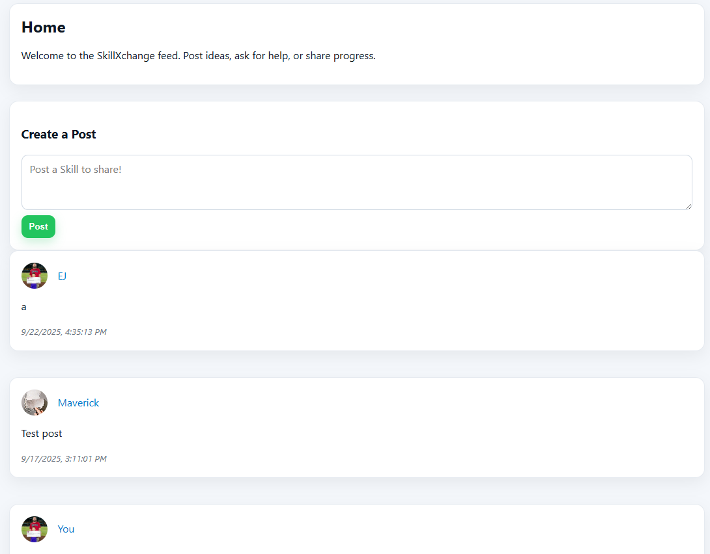
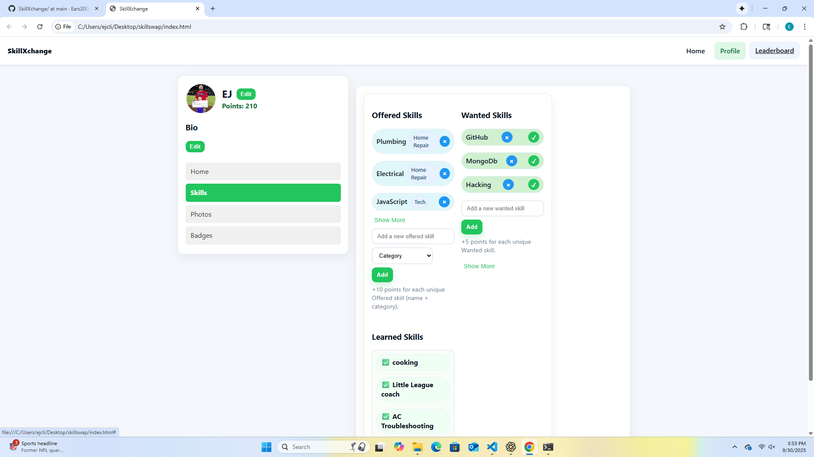
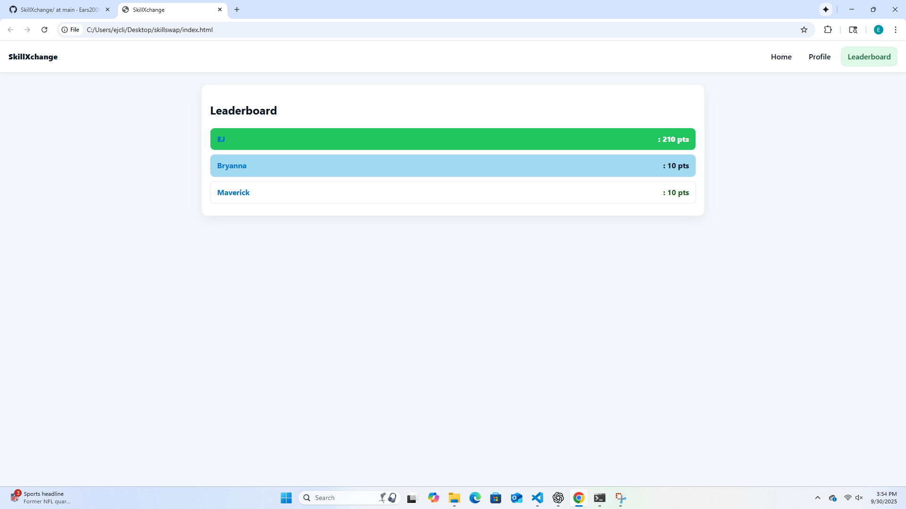

# SkillXchange

SkillXchange is a social web app where people can trade skills with each other.  
Users can create profiles, showcase the skills they offer, list skills they want to learn, and earn points by exchanging knowledge.  

---

## 🚀 Features
- **Home Feed** – Create and view posts from the community  
- **Profile** – Add a bio, edit your name, upload a photo, and show off your points  
- **Skills** – Track Offered, Wanted, and Learned skills (points system included)  
- **Leaderboard** – See the top users ranked by points (with clickable profiles)  
- **Photos** – Upload and display local photos (stored in your browser)  
- **Badges (coming soon)** – Earn achievements as you engage with the app  

---

## 🛠️ Tech Stack
- **HTML5**  
- **CSS3 (Green accent theme)**  
- **JavaScript (Vanilla JS, DOM manipulation, localStorage)**  

---

## 📸 Screenshots

### 🏠 Home


### 👤 Profile


### 🏆 Leaderboard


---

## 📦 Installation
1. Clone the repo:  
   ```bash
   git clone https://github.com/Ears2006/SkillXchange.git
